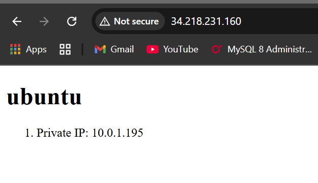

# ACIT4640-Labwk11

## Task - Ansible

Now we should have 2 ec2 instances running thanks to terraform and you can double check this in your aws ec2 dashboard on your account.

In the starter code we cloned from the repo, there's a directory called ansible and the one we will be working in going forward so we can change into that directory with cd ../ansible.

This time around the ansible.cfg will be handling the IP addresses for the hosts. In order for it to work make sure you install the following packages:

```bash
sudo apt update
sudo apt install python3-boto3 python3-botocore
```

## Task - Check Playbook Syntax

The next thing we need to do is edit our playbook.yml file as this is where we will specify what ansible will do once it connects to our EC2 instance. Assuming you have already done this, we can check the syntax of the playbook.yml file with the following:

```bash
ansible-playbook --syntax-check playbook.yml
```

This will validate the Ansible playbook for syntax errors without executing any tasks. This helps catch configuration errors before running the playbook.

## Task - Running the Playbook

Assuming you ran into no errors when checking the syntax of the playbook.yml file we can run the following command:

```bash
ansible-playbook playbook.yml
```

This executes the playbook to configure the web servers.

Assuming all went well, you should see your nginx page at http://(your-public-ip-address)


